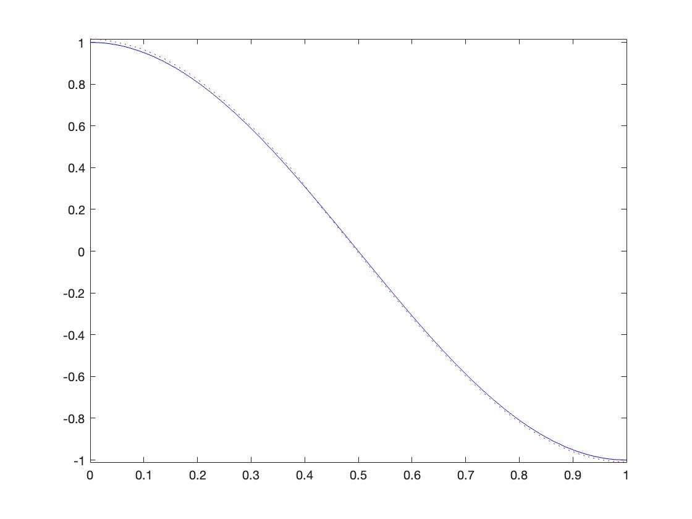

# 优化后的对偶问题比较

| base | error_at0_ori       | error_at0_dual      | error_l2_ori        | error_l2_dual       |
|------|---------------------|---------------------|---------------------|---------------------|
| 32   | 0.00545 | 0.00199 | 0.00444 | 0.00124 |
| 64   | 0.03825 | 0.01638  | 0.03671  | 0.01097 |

